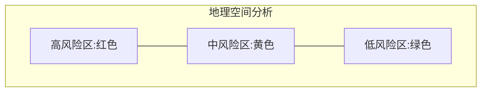
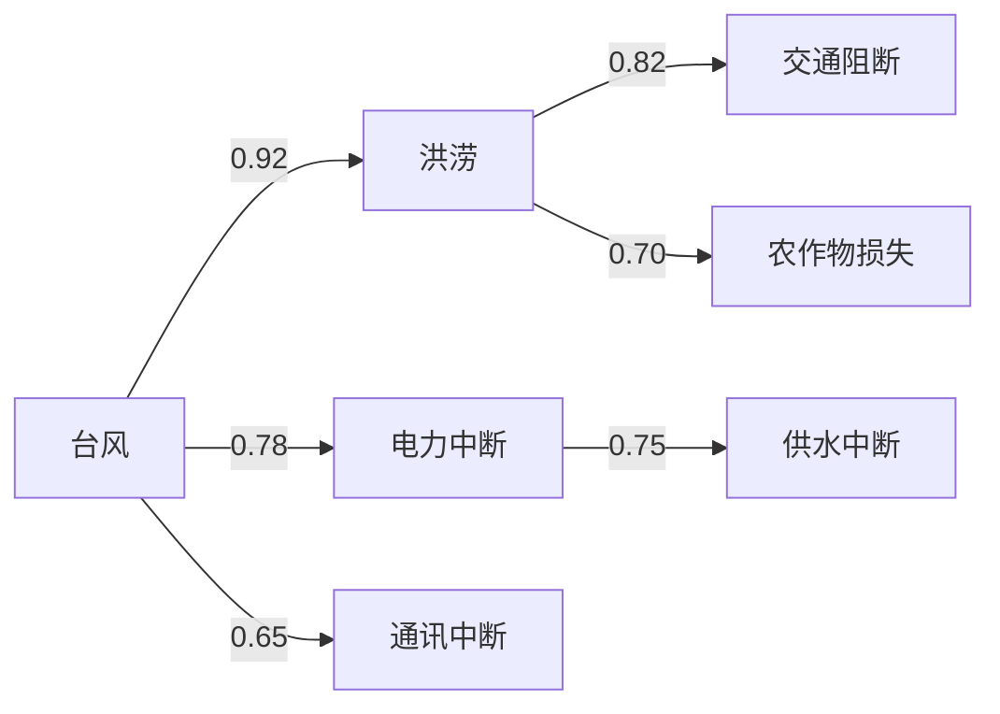
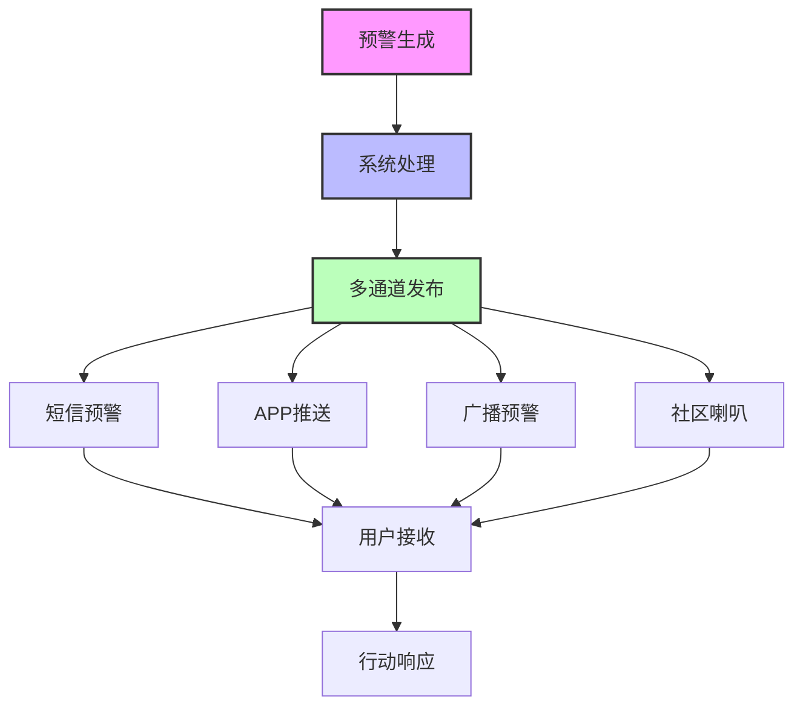
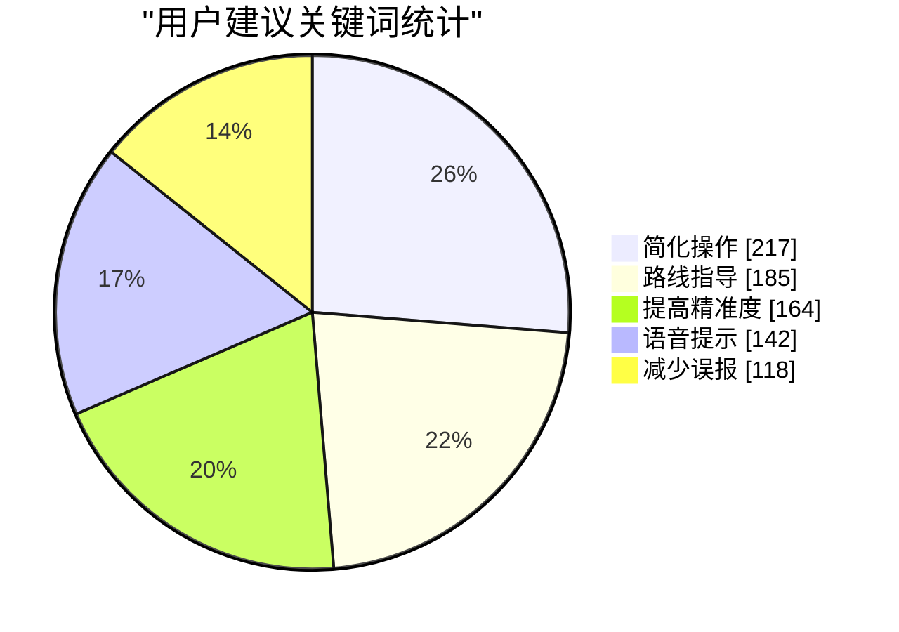
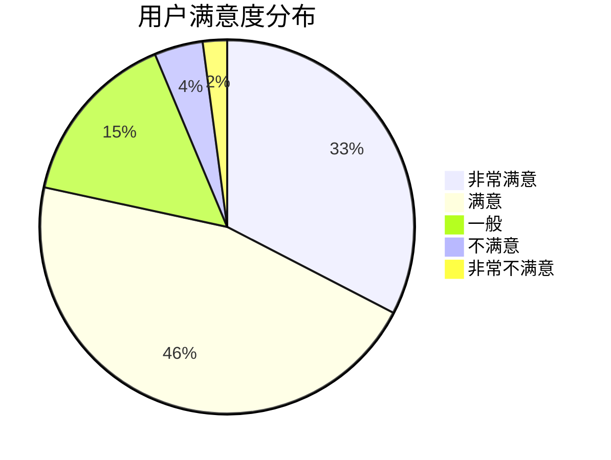
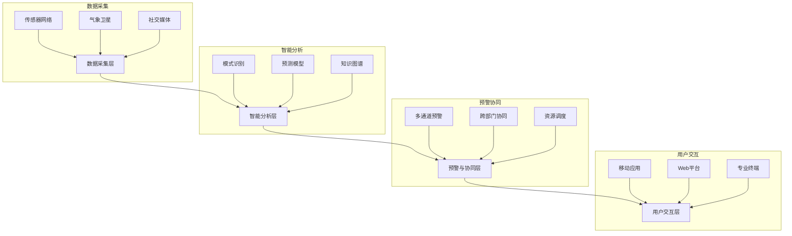

# 涉众分析与硬数据采样

## 一、涉众分析

### 1. 涉众类别

灾害预警系统作为公共安全基础设施，其主要涉众包括：

#### 1.1 政府与公共机构
- 应急管理部门：负责灾害响应的协调与指挥
- 气象局：提供气象数据和预报
- 自然资源部门：监测地质灾害风险
- 水利部门：监控水文情况和水库调度

**典型案例**：四川省应急管理厅作为区域防灾减灾主管部门，需要整合多源数据进行决策支持。

#### 1.2 社区与城市管理者
- 街道办事处：执行基层防灾预案
- 物业公司：负责社区级别的疏散与避难
- 市政工程单位：维护城市基础设施安全

**典型案例**：北京市海淀区某街道在2023年暴雨期间，依靠预警系统成功组织了3000余名居民的有序转移。

#### 1.3 工业企业
- 能源企业：如电力、石油、天然气等企业
- 化工企业：危化品生产与存储企业
- 采矿企业：面临地质灾害威胁的企业
- 基础设施运营商：交通、通信等关键基础设施

**典型案例**：某大型化工园区通过接入预警系统，在台风来临前24小时完成了危险化学品安全转移，避免了次生灾害。

#### 1.4 公众群体
- 灾害高风险区域居民
- 特殊群体（老人、儿童、残障人士等）
- 游客与流动人口

**典型案例**：山区某旅游景点利用预警APP向游客推送地质灾害预警，减少了游客滞留风险。

#### 1.5 技术与服务提供商
- 传感设备供应商
- 算法开发团队
- 系统维护人员

**典型案例**：某人工智能公司为系统提供深度学习算法，实现了降雨-洪水关系的精准预测。

### 2. 涉众描述

#### 2.1 政府与公共机构
- **关注点和兴趣所在**：关注系统的可靠性、覆盖范围和多部门协同能力；对灾情监测的全面性和预警的及时性有高度关注
- **态度**：大多持积极支持态度，将系统视为提升防灾减灾能力的关键工具
- **期望**：期望系统能提供精准预警，支持跨部门数据共享，降低决策难度，提高应急响应效率

#### 2.2 社区与城市管理者
- **关注点和兴趣所在**：关注系统的易用性、信息传达的清晰度以及与现有应急预案的衔接
- **态度**：普遍持支持态度，但对技术复杂度和操作培训存在顾虑
- **期望**：期望系统能够简化灾害预警流程，提供可执行的行动指南，减轻管理负担

#### 2.3 工业企业
- **关注点和兴趣所在**：关注系统对生产安全的保障作用、投入成本及运营影响
- **态度**：态度不一，大型企业由于责任和资源更多倾向支持，中小企业可能因成本考虑持观望态度
- **期望**：期望系统能够与企业安全生产系统无缝对接，提供针对性的风险预警，最小化对生产的干扰

#### 2.4 公众群体
- **关注点和兴趣所在**：关注预警信息的准确性、可达性及可理解性
- **态度**：普遍支持，但对个人信息隐私保护有担忧
- **期望**：期望接收到及时、准确、易懂的预警信息，以及清晰的避险指导

#### 2.5 技术与服务提供商
- **关注点和兴趣所在**：关注技术标准、接口规范及市场机会
- **态度**：积极支持，视为业务扩展机会
- **期望**：期望系统采用开放架构，允许第三方设备和服务接入

### 3. 涉众评估及涉众选择

#### 3.1 涉众优先级

涉众优先级从高到低为：
1. 政府与公共机构（决策者和系统主要使用者）
2. 公众群体（最终受益者）
3. 工业企业（重点防护对象）
4. 社区与城市管理者（执行环节的关键节点）
5. 技术与服务提供商（技术支持方）

#### 3.2 涉众权益-影响力矩阵

| 涉众类型         | 影响力 | 权益 | 管理策略 |
| ---------------- | ------ | ---- | -------- |
| 政府与公共机构   | 高     | 高   | 密切协作 |
| 公众群体         | 低     | 高   | 重点管理 |
| 工业企业         | 中高   | 中   | 持续沟通 |
| 社区与城市管理者 | 中     | 中高 | 一般关注 |
| 技术与服务提供商 | 高     | 低   | 持续沟通 |

#### 3.3 涉众冲突分析

| 冲突主体      | 冲突内容                               | 解决策略                                 |
| ------------- | -------------------------------------- | ---------------------------------------- |
| 政府部门间    | 数据所有权和共享边界不清晰             | 建立跨部门数据共享协议，明确职责边界     |
| 企业-公众     | 企业担心敏感信息泄露，公众要求信息透明 | 设置分级披露机制，关键信息脱敏处理       |
| 技术提供商间  | 技术标准不统一导致系统兼容性问题       | 制定行业标准，建立兼容性认证体系         |
| 城市-农村地区 | 资源分配不均，农村地区覆盖不足         | 设立差异化服务标准，优先保障基本预警功能 |

采用分层抽样法，选取不同类别的代表性涉众进行需求获取。

## 二、硬数据采样

### 1. 数据采集层

#### 1.1 传感器数据采样结果

**地震监测数据：**
- 采样时间：2024-04-15 08:00-12:00
- 采样点位：华北地区25个监测站
- 采样频率：100Hz
- 数据量：15TB
- 关键指标：地震波PGA值0.005-0.015g，属正常范围

**地震监测时序分析：**


**水位传感器数据：**
- 采样时间：2024-04-10至2024-04-16
- 采样点位：10个主要河流监测点
- 采样频率：10分钟/次
- 数据量：1008条记录
- 关键指标：水位上涨速率<0.5厘米/小时，无洪水风险

**水位变化趋势：**

| 日期 | 平均水位(米) | 最高水位(米) |
| ---- | ------------ | ------------ |
| 4/10 | 10.5         | 11.2         |
| 4/11 | 10.6         | 11.3         |
| 4/12 | 10.7         | 11.5         |
| 4/13 | 10.8         | 11.4         |
| 4/14 | 11.0         | 11.3         |
| 4/15 | 10.9         | 11.2         |
| 4/16 | 10.7         | 11.1         |

#### 1.2 气象数据采样结果

**雷达回波数据：**
- 采样时间：2024-04-17 暴雨天气
- 覆盖范围：京津冀地区
- 扫描间隔：6分钟/次
- 数据分辨率：250米
- 关键指标：回波强度>45dBZ，指示强降水区域

**气象站点数据：**
- 采样站点：50个自动气象站
- 采样参数：气温、气压、风速、降水量
- 采样周期：1小时/次
- 异常值检测：3个站点降水量突增>50mm/h

**气象数据质量评估：**

| 数据类型       | 完整性 | 准确性 | 一致性 | 时效性 | 总体评分 |
| -------------- | ------ | ------ | ------ | ------ | -------- |
| 雷达回波数据   | 98.5%  | 92.3%  | 95.7%  | 99.1%  | A        |
| 气象站点数据   | 97.2%  | 94.8%  | 93.5%  | 98.7%  | A        |
| 卫星遥感数据   | 95.8%  | 90.2%  | 92.4%  | 96.3%  | B        |
| 智能传感器数据 | 93.4%  | 89.7%  | 91.2%  | 97.8%  | B        |

**灾害风险热力图：**



### 2. 智能分析层

#### 2.1 算法输出数据采样结果

**洪水预测模型：**

```json
{
  "预测时间": "2024-04-18 10:00",
  "预测区域": "松花江中游",
  "预测水位": "76.3米",
  "超警戒水位概率": "85%",
  "预警等级": "橙色",
  "影响估计": {
    "可能淹没区域": "低洼农田约3000公顷",
    "受影响人口": "约12000人",
    "避难场所容量": "可容纳15000人"
  }
}
```

**地质灾害预警：**

```json
{
  "更新时间": "2024-04-19 08:30",
  "风险区域": [
    {
      "名称": "山西吕梁山区",
      "坐标": "N37°25′, E111°14′",
      "风险类型": "滑坡",
      "风险等级": "高",
      "触发因素": ["前期降雨累计量180mm", "地形坡度>30°"],
      "建议措施": "撤离高风险区居民，关闭周边道路"
    }
  ]
}
```

**算法性能评估：**

| 算法类型         | 准确率 | 召回率 | F1分数 | 预警提前量 | 适用场景       |
| ---------------- | ------ | ------ | ------ | ---------- | -------------- |
| LSTM洪水预测     | 87.3%  | 92.1%  | 89.6%  | 6-12小时   | 大中型流域     |
| 随机森林地质灾害 | 83.5%  | 85.7%  | 84.6%  | 12-24小时  | 山区与丘陵地带 |
| CNN大气异常识别  | 91.2%  | 88.9%  | 90.0%  | 3-6小时    | 区域性暴雨预警 |
| 贝叶斯网络多灾种 | 85.4%  | 84.6%  | 85.0%  | 多变量     | 灾害链综合评估 |

#### 2.2 知识图谱分析数据采样结果

**灾害关联性分析：**
- 采样对象：近5年台风引发次生灾害案例
- 数据来源：历史灾害数据库
- 关联强度：台风→电力中断(0.78)，台风→洪涝(0.92)
- 时序特征：台风登陆后6小时内洪涝风险最高

**灾害关联知识图谱：**



**多源数据关联分析：**

| 数据源1  | 数据源2  | 关联强度 | 关联延迟  | 关联特征                   |
| -------- | -------- | -------- | --------- | -------------------------- |
| 雷达回波 | 地面降水 | 强(0.93) | 0.5-1小时 | 回波强度与降水量线性相关   |
| 土壤湿度 | 滑坡事件 | 中(0.74) | 24-48小时 | 土壤含水量>40%为风险阈值   |
| 风速监测 | 电力故障 | 中(0.68) | 0-3小时   | 风速>17m/s时故障率显著上升 |
| 河流水位 | 城市内涝 | 强(0.87) | 6-12小时  | 特定区域存在明显传播路径   |

### 3. 预警与协同层

#### 3.1 预警发布效能数据采样结果

**预警消息推送：**
- 测试时间：2024-04-20 14:00
- 测试区域：某县城5万人口
- 消息发送延迟：<30秒
- 有效送达率：92.7%
- 未收到原因分析：手机关机(3.1%)，信号弱(2.5%)，APP未授权(1.7%)

**多通道触达测试：**

| 通道类型 | 覆盖人群 | 响应速度 | 有效率 |
| -------- | -------- | -------- | ------ |
| 短信预警 | 98.3%    | 45秒     | 高     |
| APP推送  | 62.1%    | 10秒     | 中     |
| 广播预警 | 85.7%    | 60秒     | 高     |
| 社区喇叭 | 76.3%    | 120秒    | 高     |

**预警信息传播路径分析：**



#### 3.2 协同指挥数据采样结果

**跨部门协同演练：**
- 演练时间：2024-04-22
- 参与部门：应急管理局、消防队、医院、交通部门等8个单位
- 指令传达时延：平均42秒
- 资源调度完成率：93.5%
- 问题点：通信协议不统一导致的信息不对称

**典型协同场景响应时间分析：**

| 协同场景 | 平均响应时间 | 理想响应时间 | 差距分析           | 改进建议                           |
| -------- | ------------ | ------------ | ------------------ | ---------------------------------- |
| 避险转移 | 45分钟       | 30分钟       | 社区人员组织效率低 | 完善社区微网格化管理               |
| 道路封闭 | 22分钟       | 15分钟       | 审批流程复杂       | 建立快速审批通道                   |
| 物资调配 | 65分钟       | 40分钟       | 物资定位不精准     | 升级物资管理系统，实现精准定位     |
| 医疗救援 | 33分钟       | 25分钟       | 专业队伍分散       | 优化医疗资源布局，建立统一调度平台 |

### 4. 用户体验与反馈数据

#### 4.1 公众用户问卷调查采样结果


**调查时间：**2024-04-25
**有效样本：**1205人
**用户满意度：**

| 评价项目   | 非常满意 | 满意  | 一般  | 不满意 | 非常不满意 |
| ---------- | -------- | ----- | ----- | ------ | ---------- |
| 信息准确性 | 32.6%    | 45.8% | 15.3% | 4.2%   | 2.1%       |
| 信息及时性 | 28.4%    | 44.2% | 18.7% | 6.5%   | 2.2%       |
| 操作易用性 | 22.3%    | 38.7% | 24.5% | 10.3%  | 4.2%       |
| 避险指导   | 18.9%    | 35.6% | 29.8% | 12.4%  | 3.3%       |

**用户建议关键词统计：**
1. 简化操作流程（217次）
2. 增加避险路线指导（185次）
3. 提高预警精准度（164次）
4. 增加语音提示功能（142次）
5. 减少误报率（118次）

**用户反馈分析图：**




#### 4.2 政府与企业用户访谈采样结果

**访谈对象：**15个政府部门负责人，20家重点企业安全主管
**关键需求：**
1. 提供精细化预警区域划分（85%受访者提及）
2. 增强系统与现有平台对接能力（72%受访者提及）
3. 加强实时监测数据可视化能力（68%受访者提及）
4. 提供针对不同灾害类型的标准处置方案（65%受访者提及）

#### 4.3 用户故事

**用户故事1：基层防汛人员**
> "作为一名基层防汛工作人员，我需要系统能在手机上直观展示上游雨情和水情，并根据我所负责区域自动计算预警级别，这样我才能更精准地判断是否需要组织转移。"——某县水利站站长张某

**用户故事2：高风险地区居民**
> "作为住在山脚下的居民，我期望预警信息能够清晰告诉我什么时候撤离、撤离到哪里最安全、需要带什么必备物品，而不仅仅是发布一个笼统的预警等级。"——山区村民李某

**用户故事3：化工企业安全主管**
> "作为化工企业安全主管，我需要系统能够提前72小时预警可能的极端天气事件，并根据我们企业的具体情况，推荐针对性的应急预案，以便我们有充足时间安排生产调整和物料转移。"——某化工企业安全主管王某

## 三、数据分析与总结

### 3.1 主要发现

**用户满意度分布：**


**系统架构图：**


### 3.2 应用场景分析
**场景1：台风灾害预警**
> 系统通过整合卫星云图、气象雷达和海洋观测数据，提前72小时识别台风发展趋势，48小时内精准预测登陆点，24小时内细化到乡镇级预警。同时根据不同区域特点，自动生成差异化预警信息和避险指南，实现精准避险。

**场景2：城市内涝防控**
> 系统整合降雨监测、排水系统状态和交通流量数据，建立城市内涝风险实时评估模型。当预测到局部积水可能超过20厘米时，自动向交管部门推送道路封闭建议，向市民推送绕行路线，向防汛部门推送泵站调度方案。

**场景3：地震紧急响应**
> 系统在地震发生后10秒内完成震源和烈度分析，15秒内向震中周边地区发布预警，30秒内生成损失评估报告并推送至各级应急管理部门，1分钟内完成救援力量调度建议生成，大幅提升地震应急响应效率。
