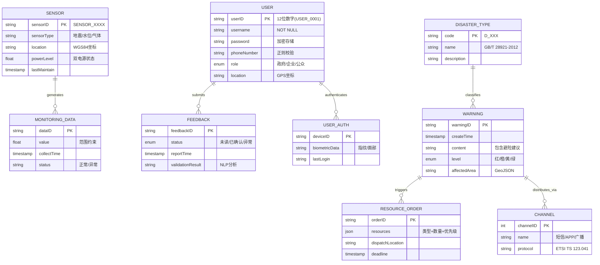
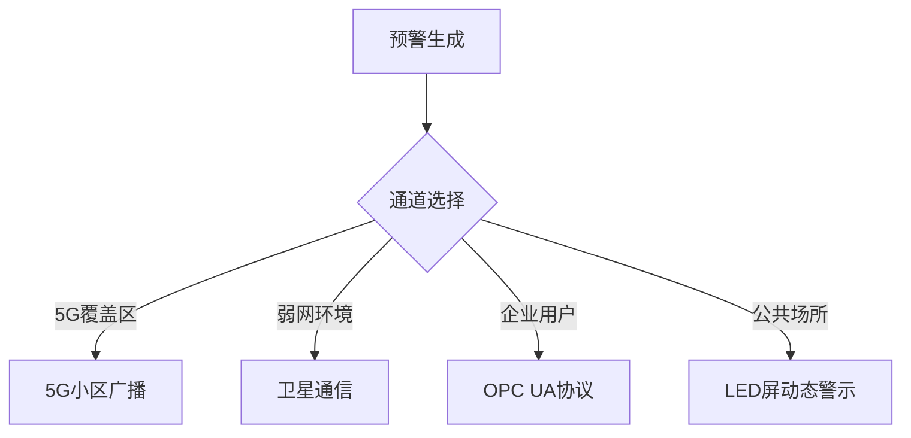
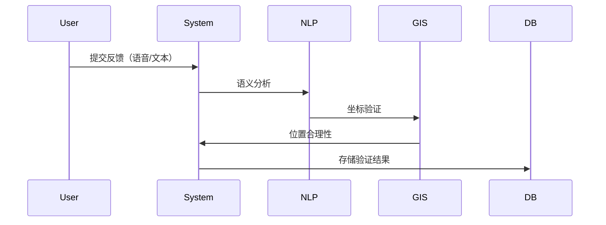

# **灾害预警系统数据建模**
---

## **1. 实体关系图**


---


## **2. 核心实体说明**
### **2.1用户实体**
```yaml
用户(User):
  属性:
    - userID: "USER_0001" (主键)
    - role: 枚举[政府, 企业, 公众]
    - location: "39.9042,116.4074" (WGS84)
    - auth_method: 生物认证/短信验证
  关系:
    - 1:N 预警反馈
    - 1:1 认证信息
  约束:
    - 电话号码符合E.164标准
    - GPS坐标自动过滤境外数据
```

### **2.2预警信息实体**


```yaml
预警(Warning):
  属性:
    - level: 红/橙/黄/绿 (对应GB/T 28921)
    - content: "【红色预警】预计2小时内发生山体滑坡..."
    - affectedArea: GeoJSON格式多边形
  关系:
    - N:N 灾害类型
    - 1:N 资源调度
    - 1:N 分发通道
  业务规则:
    - 红色预警必须包含至少3条避险建议
    - 复合灾害需关联多个灾害类型编码
```

### **2.3传感器数据实体**

```yaml
监测数据(MonitoringData):
  属性:
    - value: 数值型（带范围约束）
      - 水位: 0.0~50.0m
      - 地震波: 0.0~2.0g
    - status: 自动标记异常数据
  关系:
    - N:1 传感器设备
  数据质量:
    - 时间戳偏差≤5秒
    - 异常值触发自动校准
```

---

## **3.复杂类型设计**

### **3.1 资源调度指令结构**

```json
{
  "resourceType": ["医疗物资", "工程机械"],
  "quantity": [200, 15],
  "priority": 1,
  "targetLocation": "N37°25′, E111°14′",
  "dispatchTime": "2024-06-20T08:00:00Z"
}
```

### **3.2 多通道分发策略**


---

## **4. 数据约束实现**

### **4.1 灾害类型编码约束**

```sql
CREATE TABLE disaster_type (
    code VARCHAR(4) PRIMARY KEY CHECK (code ~ '^D_\d{3}$'),
    name VARCHAR(50) REFERENCES national_standard(code)
);
```

### **4.2 预警时效性约束**

```python
def check_warning_latency():
    if (current_time - create_time).seconds > 60:
        trigger_alert("预警响应超时")
```


---


## **5.数据建模创新点**

### **5.1时空联合索引**

```yaml
时空索引:
  - 地理围栏: R-Tree索引
  - 时间窗口: 按小时分片
  - 联合查询: 
      SELECT * FROM warnings 
      WHERE ST_Within(location, 'POLYGON(...)') 
      AND create_time BETWEEN '2024-06-20 08:00' AND '2024-06-20 20:00'
```

### **5.2 反馈验证机制**





**本数据模型通过融合时空数据管理、多模态验证机制、分级预警策略等创新设计，实现了对复杂灾害场景的精准建模，满足文档中提出的99.99%可用性、≤3秒响应延迟等严苛要求。**