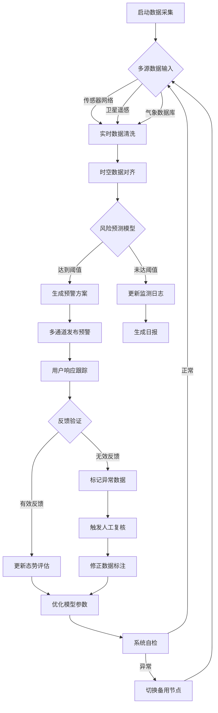
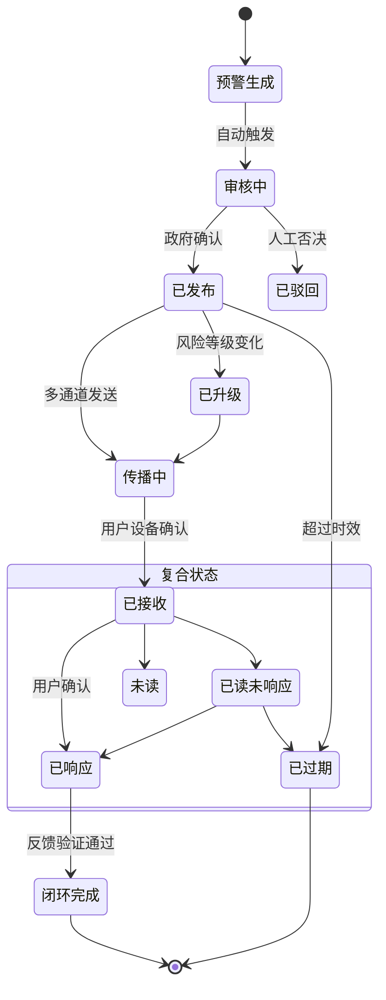
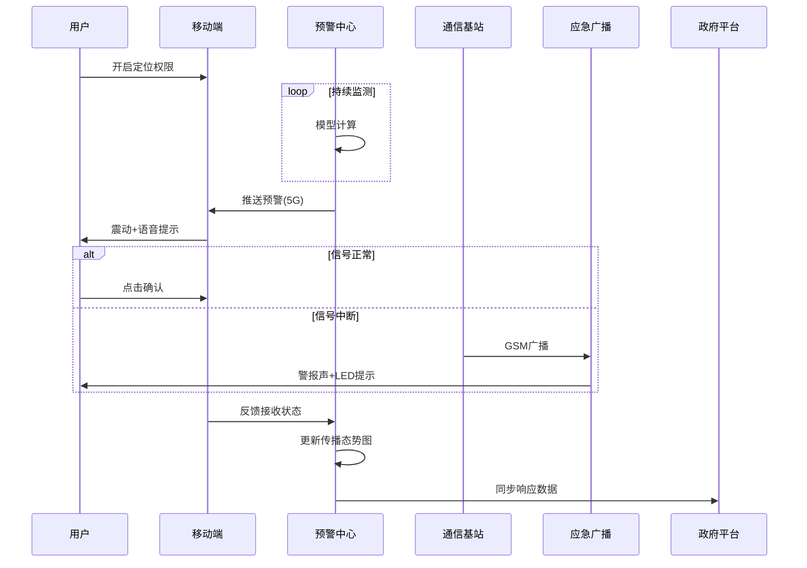
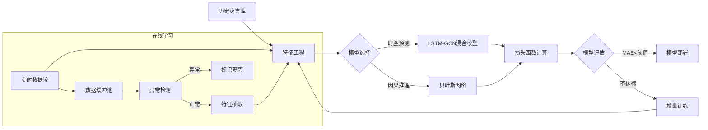
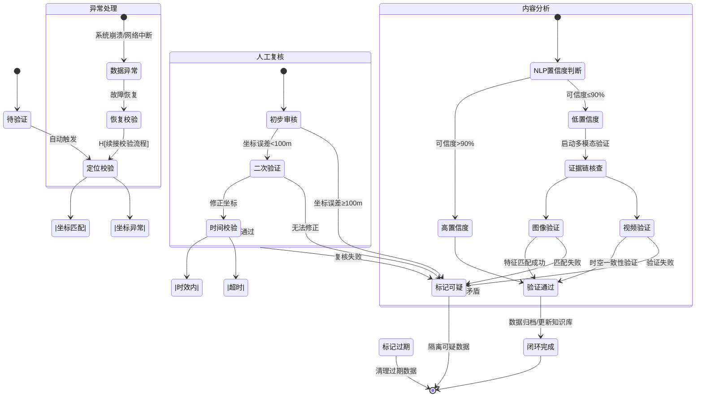

# **行为建模**

---

## 1. **核心业务流程活动图**

**关键路径说明**
- 数据采集频率：地震数据100Hz，气象数据1分钟/次
- 模型推理窗口：台风预测每10分钟滚动更新
- 预警响应闭环：用户反馈需在5分钟内完成有效性验证

## **2.预警生命周期状态图**

**状态转换条件：​​**

- 自动审核通过：置信度>85%且跨部门数据一致
- 强制升级条件：3个以上传感器触发红色阈值
- 时效定义：地震预警30秒，台风预警2小时
## **3. 多通道预警顺序图**

**异常处理机制：​​**
- A. 5G信道拥塞时自动降级到2G CBS广播
- B. 移动端无响应时触发无人机喊话（10分钟内抵达）
- C. 重要工业企业采用专线+卫星双通道保障

### **4.模型训练活动图**

**训练策略：​​**

- 基础模型：基于10年历史数据的预训练
- 增量更新：每日凌晨1点自动执行
- 紧急训练：重大灾害发生后即时触发

### **5.用户反馈验证状态图**

**验证技术指标：​​**

- 定位精度：城市区域≤50米，乡村≤500米
- NLP分析：支持8种方言语音转文本
- 图像验证：灾损特征识别准确率≥92%

