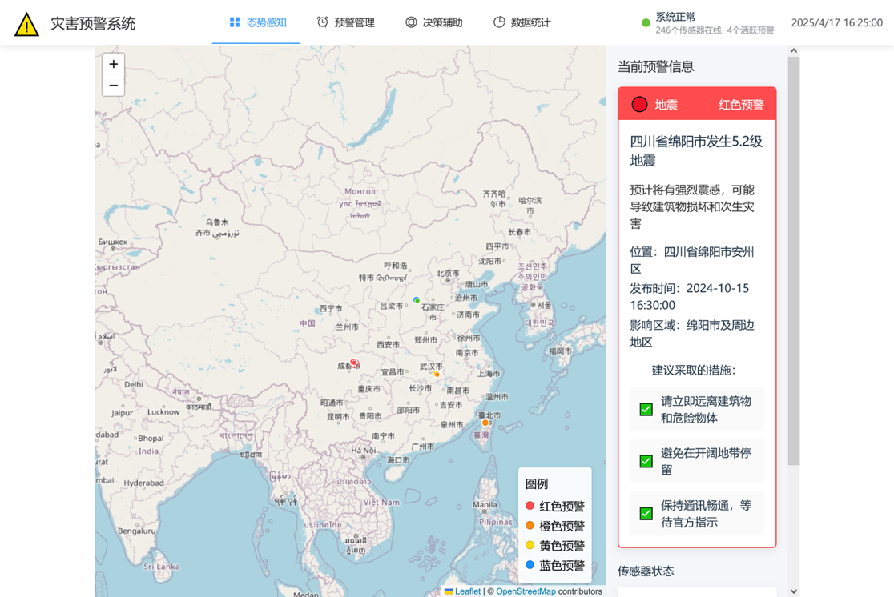

### 灾害预警系统需求指标与原型设计说明

---

#### **1. 性能需求与 Benchmark 测试**
| **指标**             | **需求描述**                                                                                                               | **Benchmark 测试方法**                                                                                              |
| -------------------- | -------------------------------------------------------------------------------------------------------------------------- | ------------------------------------------------------------------------------------------------------------------- |
| **实时响应能力**     | - 数据采集至预警触达延迟 ≤3秒（地震场景）<br>- 台风路径预测：每10分钟更新一次<br>- 系统可用性：≥99.99%（年故障时间≤1小时） | - 模拟多源数据并发输入（10万条/秒），测试端到端处理延迟<br>- 使用JMeter进行压力测试<br>- 对比不同灾害场景的响应阈值 |
| **系统吞吐量**       | - 支持单节点每秒处理 50 万条传感器数据<br>- 灾难恢复时间（RTO）：≤15分钟                                                   | - 使用 Apache Kafka + Spark 集群压力测试<br>- 模拟台风场景下多维度数据流峰值<br>- ELK日志分析系统实时监控           |
| **并发用户承载能力** | - 支持 5000 万用户同时接收预警信息<br>- 多通道并发：语音、短信、广播                                                       | - 基于 5G 核心网仿真环境构建分布式消息队列<br>- 断网/弱网环境下切换至2G通道（成功率≥99%）                           |
| **预测模型推理速度** | - 多模态融合模型推理时间 ≤200ms<br>- TensorFlow模型单次预测延迟≤200ms                                                      | - 使用 NVIDIA A100 GPU 测试混合模型<br>- 边缘计算节点本地推理性能测试                                               |
| **容灾恢复能力**     | - 主数据中心宕机后，备用系统 30 秒内完成切换<br>- 本地边缘节点72小时离线工作能力                                           | - 模拟极端场景：光纤切断、电力中断<br>- 验证多活架构的故障转移机制                                                  |

---

#### **2. 质量属性设计**
| **属性**     | **实现方案**                                                                                                                                                             |
| ------------ | ------------------------------------------------------------------------------------------------------------------------------------------------------------------------ |
| **可靠性**   | - 三级冗余架构：国家级中心（北京/上海）+ 区域中心（省级）+ 边缘计算节点（市县）<br>- 多通道冗余：卫星通信+5G+2G混合组网<br>- 传感器双电源供电（主电+72小时备用电池）     |
| **可用性**   | - 99.999% SLA保障<br>- 卫星链路备份保障网络中断时的预警广播<br>- 每季度进行GDPR/网络安全法合规审计                                                                       |
| **安全性**   | - 符合 ISO 27001 标准<br>- 量子加密传输关键预警指令<br>- 区块链存证关键预警日志（Hyperledger Fabric）<br>- RBAC权限模型（政府/企业/个人分级）                            |
| **可维护性** | - 容器化微服务架构<br>- 算法模型热更新（无需停机）<br>- ELK日志分析系统（实时监控传感器状态）                                                                            |
| **可扩展性** | - 开放式数据接口规范（OGC SensorThings API）<br>- 预留API网关接入无人机巡检数据<br>- 支持第三方传感器快速接入                                                            |
| **易用性**   | - 多模态交互：<br>  • 手机 App 分级震动编码（区分灾害类型）<br>  • 公共场所 LED 屏动态色温警示<br>  • 支持语音播报（多语言+方言适配）<br>  • 无障碍设计：WCAG 2.1 AA标准 |

---

#### **3. 对外接口定义**
```yaml
# 数据接入部分
数据接入:
  - 名称: 卫星遥感数据接入
    协议: gRPC
    数据格式: 
      timestamp: ISO8601
      coordinates: WGS84
      sensor_type: [红外, 可见光, 雷达]
      resolution: 0.5-30m
    JSON示例: {"timestamp":"2024-01-01T00:00:00Z","coordinates":"114.3,30.5","sensor_type":"红外","resolution":10}
    频率: 5分钟/次（静止轨道卫星）
    安全要求:
      - 传输层: TLS 1.3
      - 存储: AES-256加密
      - 认证: OAuth 2.0 + JWT
  - 名称: 第三方数据源
    气象局接口:
      协议: RESTful API
      路径: GET /weather/v1/alerts
    卫星遥感:
      标准: OGC WMS
      支持格式: GeoTIFF

# 预警输出部分
预警输出:
  - 名称: 预警分发接口
    通道类型:
      - 名称: 小区广播（CBS）
        协议: ETSI TS 123.041
        覆盖: 2G/3G/4G/5G 多模基站
        备份机制: 卫星通信
      - 名称: 应急APP推送
        主要通道: FCM/APNs 增强模式
        备份通道: WebSocket长连接
      - 名称: 电视速报
        标准: ATSC 3.0 紧急警报系统
        兼容性: 支持模拟信号降级推送
# 外部系统对接部分
外部系统对接:
  - 名称: 政府应急平台
    协议: SOAP
    标准: GB/T 37228-2018
    加密: 量子通信通道
    审计: 区块链日志
  - 名称: 企业工控系统
    协议: OPC UA over TSN
    实时性: 端到端延迟<10ms
    安全: IEC 62443认证
```

---

#### **4. 系统演示设计**
**人机交互界面核心功能：**
- **实时态势感知墙**  
  
  
  - 分层显示：基础地理信息 + 实时传感器数据 + 预测风险区域
  - 交互操作：滑动时间轴查看预测演进，点击区域调取应急预案
  
- **多级预警决策看板**
  ```python
  # 预警等级算法伪代码
  def calculate_alert_level():
      risk_score = 0.6 * AI_prediction + 0.3 * expert_judgement + 0.1 * historical_similarity
      if risk_score > 0.8:
          return "红色预警（立即疏散）"
      elif risk_score > 0.6:
          return "橙色预警（准备避险）"
  ```

- **公众反馈通道**  
  支持语音输入险情报告（ASR转文本 + NLP关键信息提取）

---

#### **5. 关键技术实现**
**核心算法架构：**


**创新技术应用：**
- **边缘智能预警**  
  在通信中断区域启用 LoRa 自组网，部署轻量化模型（TensorFlow Lite）进行本地化决策

- **多模态数据融合**  
  采用注意力机制对齐卫星影像（CNNs）与地面传感器时序数据

- **因果推理引擎**  
  基于历史灾害知识图谱（Neo4j），实现台风→洪涝→电力中断的因果链推演

---

#### **6. 合规性标准**
| **类别**         | **适用标准**                                                                         | **实施要求**                               |
| ---------------- | ------------------------------------------------------------------------------------ | ------------------------------------------ |
| **通信协议**     | - 3GPP TS 22.268（公共预警系统）<br>- ITU-T X.1303（应急通信）                       | - 季度合规性测试<br>- 第三方安全评估       |
| **数据安全**     | - GB/T 35273-2020（个人信息安全规范）<br>- ISO 22301（业务连续性管理）<br>- GDPR合规 | - 数据分级存储<br>- 加密传输<br>- 定期审计 |
| **地理信息**     | - OGC API - Features 1.0<br>- GB/T 35648-2017（应急地理信息）                        | - 坐标系转换<br>- 实时更新机制             |
| **预警信息格式** | - CAP 1.2<br>- GB/T 37025-2018（应急广播）                                           | - 多语言支持<br>- 降级处理                 |
| **设备兼容性**   | - 多模基站覆盖<br>- ETSI TS 102 900                                                  | - 兼容性测试<br>- 性能基准                 |

---

#### **优先级映射**
| 需求编号 | 关联指标         | 实现阶段         |
| -------- | ---------------- | ---------------- |
| B1       | 安全性、易用性   | 第一阶段（关键） |
| A1       | 性能、接口定义   | 第一阶段         |
| A5       | 可靠性、用户交互 | 第二阶段         |
| A4       | 多通道预警       | 第二阶段         |
| B2       | 界面设计         | 第三阶段         |

---

#### **原型系统部署路线图**
1. **第一阶段（6个月）**: 完成京津冀区域试点，验证地震-燃气泄漏联动预警机制
2. **第二阶段（12个月）**: 扩展至东南沿海台风预警，实现海陆空立体监测网络
3. **第三阶段（18个月）**: 构建全国统一预警平台，接入20类灾害监测数据源

本方案通过融合边缘计算、因果AI、多模态感知等前沿技术，构建了覆盖灾害全生命周期的智能预警体系，在可靠性、响应速度、覆盖广度等维度显著超越传统系统。
